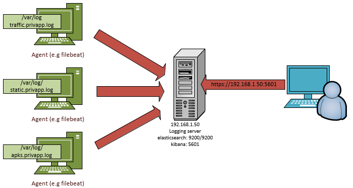

# Logging module
The logging module is an agent-based architecture for gathering logs of all components of the PrivApp platform. It is decoupled from the Platform, so any component only needs to write logs to a local file and no more. An independent beat agent will then send the logs to a server and a user can visualize and analyze them.  

## Requisites

- Configure server: see [server/README.md](server)
- Configure agents: see [agent/README.md](agent)

## Modules Log's fields

[Link a #logging](https://gitlab.com/privapp/browser#logging)

### Browser

'json.apk' -> APK’s name  
'json.exception_message' -> Message  
'json.reason' -> Failure reason can be: ’ListApps' or ‘Browse’  
'json.container' -> browser  
'json.testing_label' -> Testing label 

### Storage

'json.apk' -> APK's name  
'json.version' -> App’s version  
'json.container' -> 'storage'  
'json.type' -> Format of privacy policies doc: can be html or txt  
'json.testing_label' -> Testing label

### Downloader

'json.apk' -> APK’s name  
'json.type' -> Format of privacy policies doc: can be html or txt  
'json.exception_message' -> Error message  
'json.reason' -> Failure reason  
'json.url' -> Privacy policy URL  
'json.container' -> 'downloader'  
'json.testing_label' -> Testing label  

### usoRecursos

'json.apk' -> APK’s name  
'json.version' -> App’s version  
'json.container' -> 'usoRecursos'  
'json.testing_label'-> Testing label  
'json.data’-> {  
&nbsp;&nbsp;&nbsp;&nbsp;&nbsp;&nbsp;'found_method' -> searched_method  
&nbsp;&nbsp;&nbsp;&nbsp;&nbsp;&nbsp;'found_class' -> searched_class  
&nbsp;&nbsp;&nbsp;&nbsp;&nbsp;&nbsp;'data_category' -> category  
&nbsp;&nbsp;&nbsp;&nbsp;&nbsp;&nbsp;'data_description' -> description  
&nbsp;&nbsp;&nbsp;&nbsp;&nbsp;&nbsp;'permission_required' -> permissions  
&nbsp;&nbsp;&nbsp;&nbsp;&nbsp;&nbsp;'caller_method' -> method_name  
&nbsp;&nbsp;&nbsp;&nbsp;&nbsp;&nbsp;'caller_class' -> class_name  
&nbsp;&nbsp;&nbsp;&nbsp;&nbsp;&nbsp;'caller_party' -> first_party  
}

### Bibliotecas

'json.apk' -> APK’s name  
'json.version' -> App’s version  
'json.container' -> 'bibliotecas'  
'json.testing_label' -> Testing label  
'json.exception_message' -> Error message  
'json.data' -> {  
&nbsp;&nbsp;&nbsp;&nbsp;&nbsp;&nbsp;'tool' -> 'LibScout' or ‘LiteRadar’  
&nbsp;&nbsp;&nbsp;&nbsp;&nbsp;&nbsp;'libreria' -> Library used  
&nbsp;&nbsp;&nbsp;&nbsp;&nbsp;&nbsp;'categoria' -> App category  
}

### Metadatos

‘json.apk' -> APK’s name  
‘json.version' -> App’s version  
‘json.container' -> metadatos  
‘json.message’ -> Status message  
‘json.testing_label' -> Testing label  
‘json.data' -> {  
&nbsp;&nbsp;&nbsp;&nbsp;&nbsp;&nbsp;'propietario' -> App provider,  
&nbsp;&nbsp;&nbsp;&nbsp;&nbsp;&nbsp;'emisor' -> App dispatcher entity,  
&nbsp;&nbsp;&nbsp;&nbsp;&nbsp;&nbsp;'numSerie' -> Serial number,  
&nbsp;&nbsp;&nbsp;&nbsp;&nbsp;&nbsp;'validez' -> Validity date,  
&nbsp;&nbsp;&nbsp;&nbsp;&nbsp;&nbsp;'sha1' -> Secure Hash Algorithm 1,  
&nbsp;&nbsp;&nbsp;&nbsp;&nbsp;&nbsp;'sha256' -> Secure Hash Algorithm 256,  
&nbsp;&nbsp;&nbsp;&nbsp;&nbsp;&nbsp;'algFirma' -> Sign algorithm ,  
&nbsp;&nbsp;&nbsp;&nbsp;&nbsp;&nbsp;'algClavePub' -> Public Key Algorithm,  
&nbsp;&nbsp;&nbsp;&nbsp;&nbsp;&nbsp;'version' -> Certificate version,  
&nbsp;&nbsp;&nbsp;&nbsp;&nbsp;&nbsp;'type_permission' -> Permission type,  
&nbsp;&nbsp;&nbsp;&nbsp;&nbsp;&nbsp;'permission_name' -> Permission name,  
&nbsp;&nbsp;&nbsp;&nbsp;&nbsp;&nbsp;'protection_level' -> Protection level,  
&nbsp;&nbsp;&nbsp;&nbsp;&nbsp;&nbsp;'md5' -> md5,  
&nbsp;&nbsp;&nbsp;&nbsp;&nbsp;&nbsp;‘files in /libs’ -> files located in lib folder  
}
